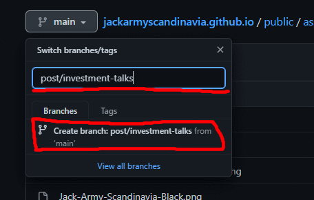
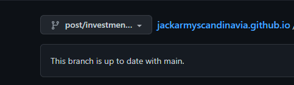
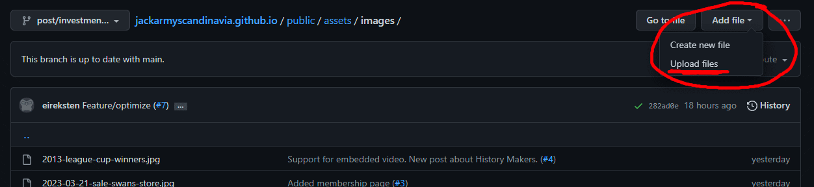
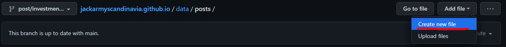
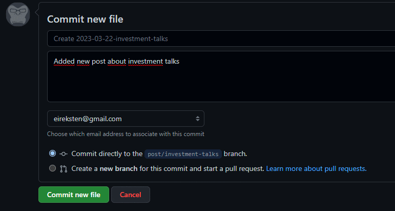
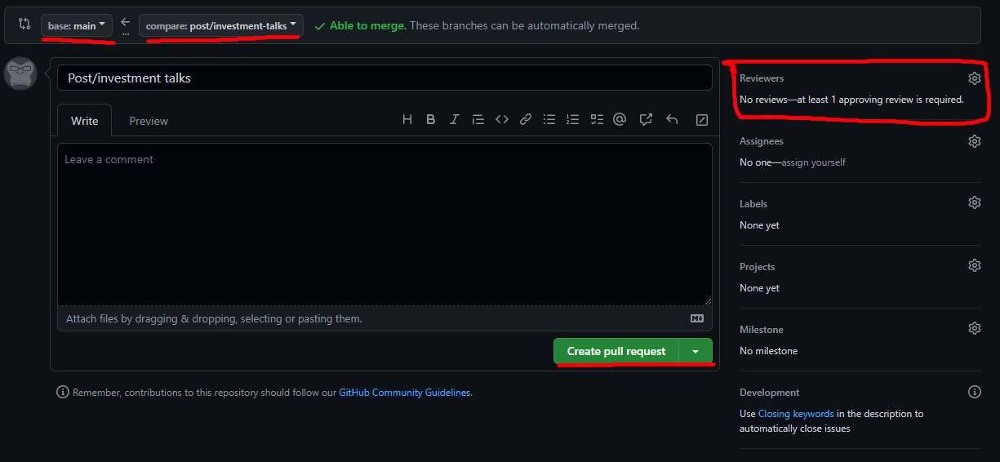

# Hjemmesiden til Jack Army Scandinavia

Innlegg ligger i mappen `data/_posts` som Markdownfiler med støtte for metainformasjon. Legger man inn en ny markdownfil der vil den dukke opp som en ny artikkel (eventuelt ved publiseringsdato).

## Legge til et innlegg gjennom nettsiden til Github

1. Repo: https://github.com/jackarmyscandinavia/jackarmyscandinavia.github.io

2. Opprett en branch kalt `post/[name]` hvor `[name]` lar deg kjenne igjen branchen din (og gjerne hinter til innholdet). Du kan bruke bindestrek for å dele ord.



3. Pass på at den nye branchen er valgt



4. Legg inn et artikkelbilde under `public/images/` hvis du ikke skal bruke et som allerede ligger der.



5. Opprett en fil for innlegget under `data/posts/` kalt `[slug].md`, hvor `[slug]` er den siste delen av url'en for artikkelen. Se på filnavnene som ligger der fra før.



6. Legg til innhold i filen, formatert følgende måte. Det kan være nyttig å kikke på [Basic Syntax](https://www.markdownguide.org/basic-syntax/) eller [Markdown Cheat Sheet](https://www.markdownguide.org/cheat-sheet/), dersom du ikke har brukt dette før. Se gjerne på noen av de andre filene i `data/posts` om du blir usikker.

```
---
title: 'Her skriver du tittelen på artikkelen'
excerpt: 'Her legger du inn utdraget til førstesiden. Du kan f.eks. kopiere inn første avsnitt.'
coverImage: '/images/[bildet ditt]'
embeddedYouTube: 'youtube-link for å legge inn i artikkelen. Denne linjen kan sløyfes'
date: 'yyyy-mm-dd'
author:
  name: Navnet ditt
  picture: '/images/authors/[bilde av deg]'
ogImage:
  url: '/images/[bildet ditt]'
---

Her skriver du inn innholdet i Markdown-format, utenom tittelen.

```

7. Lagre og commit filen.



8. Nå er den klar og du kan opprette en pull request. Sjekk at base er `main` og at compare er branchen din. Legg til minst en reviewer og klikk `Create pull request`



9. Få den som er reviewer til å godkjenne og merge pull requesten, så skal det bli publisert straks!

## Bygging og testing

Dersom du vil kjøre denne lokalt, trenger du npm installert (https://nodejs.org/). Deretter må du kjøre kommandoen `npm install` i prosjektmappen for at alle avhengigheter skal bli installert. Så kan man starte en lokal server med `npm run dev` og åpne [http://localhost:3000](http://localhost:3000) for å kikke på siden.
